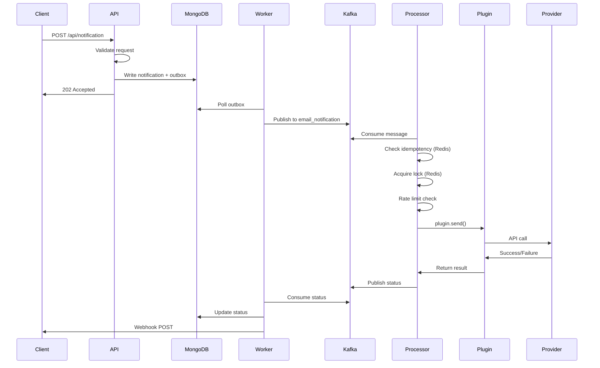
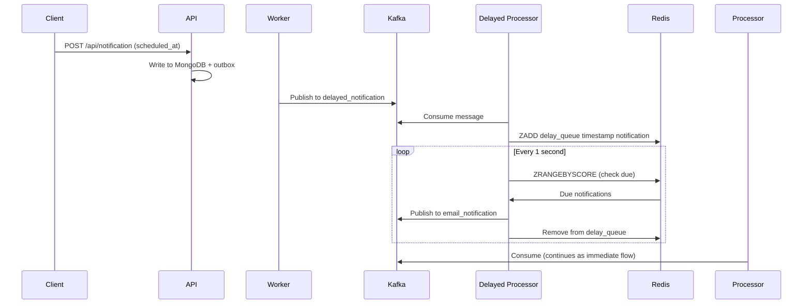
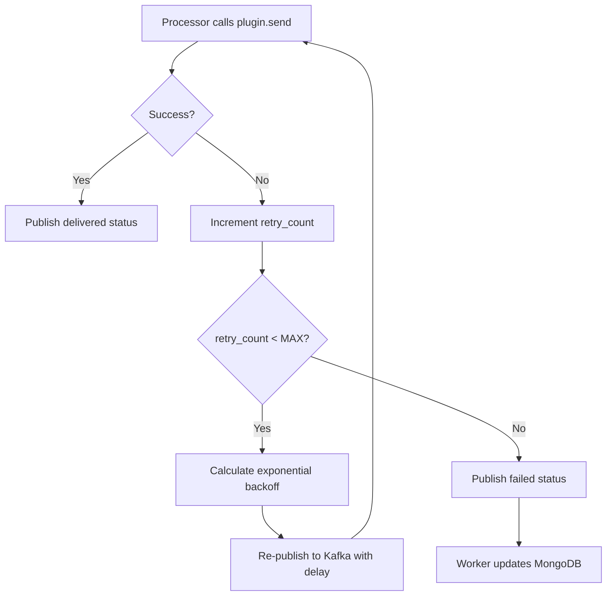
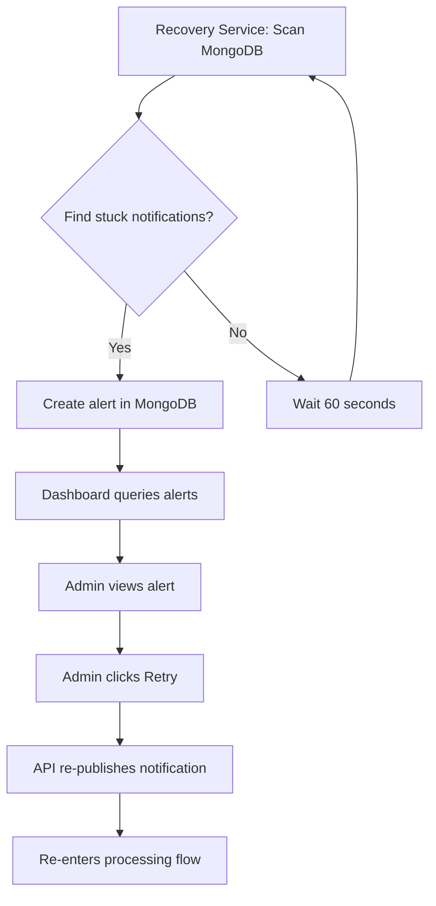

import { Tab, Tabs } from 'fumadocs-ui/components/tabs';
import { Step, Steps } from 'fumadocs-ui/components/steps';

## High-Level Architecture


SimpleNS follows an event-driven, microservices-inspired architecture where each component has a specific responsibility. The system is built around the **outbox pattern** for reliability and uses **Kafka** for event streaming.

### Core Principles

**1. Separation of Concerns**
- **Orchestration** (SimpleNS Core): Handles retries, rate limiting, scheduling, recovery
- **Delivery** (Plugins): Handles actual notification sending via provider APIs

**2. Plugin-Based Extensibility**
- Swap providers without changing application code
- Community-driven ecosystem
- Easy to build custom integrations

**3. Horizontal Scalability**
- Scale each component independently
- Partition-based parallelism
- Load distribution across workers

**4. Fault Tolerance**
- Outbox pattern prevents message loss
- Crash recovery for stuck notifications
- Automatic retries with exponential backoff

## System Components

### API Server

**Responsibility:** REST API for notification ingestion

**Key Features:**
- `/api/notification` - Single notification endpoint
- `/api/notification/batch` - Bulk notifications (max-limit per request configurable in (.env)) 
- Request validation using Zod schemas
- Bearer token authentication

**Technology:** Express.js, TypeScript

**Scaling:** Multiple instances behind load balancer

**Data Flow:**

<Steps>
<Step>
Receives HTTP POST request
</Step>

<Step>
Validates authentication and payload
</Step>

<Step>
Writes to MongoDB in transaction:
- Creates notification document
- Creates outbox entry
</Step>

<Step>
Returns 202 Accepted with `notification_id`
</Step>

<Step>
Background worker picks up from outbox
</Step>
</Steps>

### Background Worker

**Responsibility:** Polls outbox, publishes to Kafka, updates status

**Key Features:**
- Polls MongoDB outbox table every 5 seconds (configurable)
- Publishes notifications to appropriate Kafka topics
- Consumes status updates from notification_status kafka topic
- Updates notification status in MongoDB
- Sends webhook callbacks
- Handles worker crashes via claim timeouts

**Technology:** Node.js, MongoDB, Kafka Producer/Consumer

**Scaling:** Multiple worker instances (distributed claiming prevents duplicates)

**Data Flow:**

<Steps>
<Step>
Polls outbox for unpublished entries
</Step>

<Step>
Claims entries with worker ID and timestamp
</Step>

<Step>
Determines target Kafka topic based on:
- Immediate notification → channel-specific topic (e.g., `email_notification`)
- Scheduled notification → `delayed_notification` topic
</Step>

<Step>
Publishes to Kafka
</Step>

<Step>
Marks outbox entry as published
</Step>

<Step>
Consumes status updates and updates MongoDB
</Step>

<Step>
Sends webhooks (if configured)
</Step>
</Steps>

### Unified Notification Processor

**Responsibility:** Plugin-based notification delivery with rate limiting

**Key Features:**
- Loads plugins from `.plugins/` directory based on `simplens.config.yaml`
- Consumes from channel-specific Kafka topics
- Per-provider rate limiting (Token Bucket Algorithm)
- Exponential backoff retries (configurable, default: 5 attempts)
- Idempotency using Redis cache
- Processing locks via Redis (TTL: 2 minutes)
- Publishes delivery status to `notification_status` topic

**Technology:** Node.js, Kafka Consumer, Redis, Plugin SDK

**Scaling:**
- Multiple processor instances per channel
- Kafka partition-based parallelism
- Can run channel-specific processors (e.g., only email)

**Configuration:**

```bash
PROCESSOR_CHANNEL=all  # or 'email', 'sms', etc.
MAX_RETRY_COUNT=5
PROCESSING_TTL_SECONDS=120
```

**Data Flow:**

<Steps>
<Step>
Consumes message from Kafka topic
</Step>

<Step>
Checks idempotency (Redis cache by `notification_id`)
</Step>

<Step>
Acquires processing lock (Redis)
</Step>

<Step>
Rate limit check (wait if bucket empty)
</Step>

<Step>
Validates notification against plugin schema
</Step>

<Step>
Calls `plugin.send(notification)`
</Step>

<Step>
On success: Publish `delivered` status
</Step>

<Step>
On failure: Calculate backoff, republish to Kafka for retry, or mark `failed`
</Step>

<Step>
Release lock, update idempotency cache
</Step>
</Steps>

### Delayed Processor

**Responsibility:** Handles scheduled notifications

**Key Features:**
- Redis ZSET-based delay queue (score = Unix timestamp)
- Polls every 1 second for due notifications (configurable)
- Fetches batch of due notifications (default: 10)
- Publishes to appropriate channel topics
- Handles poller failures with retries

**Technology:** Node.js, Redis ZSET, Kafka Producer

**Scaling:** Multiple Delayed Processor instances (Two-Phase Commit)

**Data Flow:**

<Steps>
<Step>
Worker publishes notification to `delayed_notification` topic
</Step>

<Step>
Delayed processor consumes, extracts `scheduled_at`
</Step>

<Step>
Adds to Redis ZSET: `ZADD delay_queue <timestamp> <notification_id>`
</Step>

<Step>
Poller checks Redis: `ZRANGEBYSCORE delay_queue -inf <now> LIMIT 0 10`
</Step>

<Step>
For each due notification:
- Publishes to channel topic (e.g., `email_notification`)
- Removes from delay queue
</Step>

<Step>
Unified processor picks up and delivers
</Step>
</Steps>

### Recovery Service

**Responsibility:** Detects orphaned/stuck notifications and creates alerts

**Key Features:**
- Runs every 60 seconds (configurable)
- Detects notifications stuck in `processing` state (timeout: 5 minutes)
- Detects notifications stuck in `pending` state (timeout: 5 minutes)
- Creates alerts in MongoDB for manual intervention
- Cleanup of resolved alerts (retention: 24 hours)
- Cleanup of processed status outbox entries

**Technology:** Node.js, MongoDB, Cron-like polling

**Scaling:** Single instance (uses distributed locks for multi-instance support)

**Alert Types:**
- `orphaned_processing` - Notification processing lock expired
- `orphaned_pending` - Notification never picked up by processor

**Data Flow:**

<Steps>
<Step>
Query MongoDB for notifications in `processing` state
</Step>

<Step>
Filter where `updated_at < now - PROCESSING_STUCK_THRESHOLD_MS`
</Step>

<Step>
Create alert document with notification details
</Step>

<Step>
Dashboard displays alerts
</Step>

<Step>
Admin can manually retry or resolve
</Step>
</Steps>

### Admin Dashboard

**Responsibility:** Web-based monitoring and management

**Key Features:**
- Dashboard home with statistics
- Events explorer with search and filtering
- Failed events page with retry capabilities
- Alerts management
- Analytics and charts
- Plugins registry view
- Payload Studio for API schema exploration
- Authentication via NextAuth

**Technology:** Next.js, React, MongoDB direct queries, shadcn/ui

**Scaling:** Multiple instances (stateless, session in cookies)

**Pages:**
- `/` - Dashboard home
- `/events` - All notifications
- `/events/[id]` - Notification details
- `/failed` - Failed notifications
- `/alerts` - System alerts
- `/analytics` - Charts and graphs
- `/plugins` - Installed plugins
- `/payload-studio` - API schema builder

## Infrastructure Components

### MongoDB

**Purpose:** Persistent storage for notifications, outbox, alerts

**Configuration:**
- Replica set required (minimum 1 node for dev, 3 for production)
- Collections:
  - `notifications` - Notification documents
  - `outbox` - Outbox pattern entries
  - `alerts` - Recovery alerts
  - `status_outbox` - Status update outbox
- Indexes for performance on `status`, `created_at`, `notification_id`

**Data Model:**

```javascript
// Notification
{
  notification_id: "mongoose object_id",
  request_id: "uuid",
  client_id: "uuid",
  channel: ["email"],
  recipient: { user_id: "u1", email: "test@example.com" },
  content: { email: { subject: "...", message: "..." } },
  status: "pending",  // pending, processing, delivered, failed
  scheduled_at: ISODate("..."),
  webhook_url: "https://...",
  created_at: ISODate("..."),
  updated_at: ISODate("..."),
  retry_count: 0
}
```

### Kafka

**Purpose:** Event streaming and message queue

**Topics:**
- `{channel}_notification` - Channel-specific (e.g., `email_notification`, `sms_notification`)
- `delayed_notification` - Scheduled notifications
- `notification_status` - Delivery status updates

**Partitioning Strategy:**
- Channel topics: Configurable partitions (env: `{CHANNEL}_PARTITION`)
- More partitions = more parallel consumers
- Partition by `notification_id` hash for ordering within same notification

**Configuration:**

```bash
EMAIL_PARTITION=5
SMS_PARTITION=3
DELAYED_PARTITION=1
NOTIFICATION_STATUS_PARTITION=1
```

### Redis

**Purpose:** Caching, delay queue, rate limiting

**Use Cases:**

**1. Delay Queue (ZSET)**
```bash
ZADD delay_queue <scheduled_timestamp> <notification_json>
```

**2. Idempotency Cache**
```bash
SET idempotency:<notification_id> <result> EX 86400
```

**3. Rate Limiting (Token Bucket)**
```bash
HSET rate_limit:<provider_id> tokens <count> last_refill <timestamp>
```

**4. Processing Locks**
```bash
SET processing:<notification_id> <worker_id> EX 120
```

### Loki + Grafana

**Purpose:** Centralized logging and visualization

**Configuration:**
- All services send logs to Loki via winston-loki
- Grafana datasource configured for Loki
- Labels: `service`, `level`, `notification_id`
- Query examples:

```bash
{service="api"}
{service="notification-processor", level="error"}
{notification_id="abc123"}
```

## Data Flow

### Immediate Notification Flow



**Step-by-step:**

<Steps>
<Step>
Client → POST `/api/notification`
</Step>

<Step>
API validates, writes to MongoDB (notification + outbox)
</Step>

<Step>
API returns 202 Accepted
</Step>

<Step>
Worker polls outbox
</Step>

<Step>
Worker publishes to Kafka (`email_notification` topic)
</Step>

<Step>
Processor consumes from Kafka
</Step>

<Step>
Processor checks idempotency (Redis)
</Step>

<Step>
Processor acquires lock (Redis)
</Step>

<Step>
Processor checks rate limit
</Step>

<Step>
Processor calls `plugin.send()`
</Step>

<Step>
Plugin delivers via provider API
</Step>

<Step>
Processor publishes status to Kafka (`notification_status` topic)
</Step>

<Step>
Worker consumes status update
</Step>

<Step>
Worker updates MongoDB (status = delivered)
</Step>

<Step>
Worker sends webhook POST (if configured)
</Step>
</Steps>

### Scheduled Notification Flow



**Step-by-step:**

<Steps>
<Step>
Client → POST `/api/notification` (with `scheduled_at`)
</Step>

<Step>
API writes to MongoDB + outbox
</Step>

<Step>
Worker publishes to `delayed_notification` topic
</Step>

<Step>
Delayed processor consumes, adds to Redis ZSET
</Step>

<Step>
Delayed processor polls Redis for due notifications
</Step>

<Step>
When due, publishes to `email_notification` topic
</Step>

<Step>
Continues as immediate flow from step 6
</Step>
</Steps>

### Retry Flow



**Step-by-step:**

<Steps>
<Step>
Processor calls `plugin.send()`
</Step>

<Step>
Plugin returns `{ success: false, error: "..." }`
</Step>

<Step>
Processor increments `retry_count`
</Step>

<Step>
If `retry_count < MAX_RETRY_COUNT`:
- Calculate backoff delay (exponential)
- Re-publish to same Kafka topic (with delay via Redis)
- Repeat from step 1
</Step>

<Step>
Else:
- Publish status = `failed`
- Worker updates MongoDB
</Step>
</Steps>

### Recovery Flow



**Step-by-step:**

<Steps>
<Step>
Recovery service scans MongoDB (every 60s)
</Step>

<Step>
Finds notifications where:
- `status = processing` AND `updated_at > 5 min ago`
- `status = pending` AND `updated_at > 5 min ago`
</Step>

<Step>
Creates alert in MongoDB
</Step>

<Step>
Dashboard queries alerts collection
</Step>

<Step>
Admin views alert, clicks "Retry"
</Step>

<Step>
Dashboard calls API to re-publish notification
</Step>

<Step>
Notification re-enters processing flow
</Step>
</Steps>

## Scalability Model

### Horizontal Scaling

#### API Server

- Run multiple instances behind load balancer (NGINX, ALB)
- Stateless (no in-memory session)
- Share same MongoDB and Kafka

#### Background Worker

- Multiple instances supported
- Distributed claiming via MongoDB (`worker_id` + `claimed_at`)
- Claim timeout handles crashed workers

#### Notification Processor

- Scale independently per channel
- Kafka consumer group ensures no duplicate processing
- Increase instances to reduce consumer lag

#### Delayed Processor

- Typically 1-2 instances
- Redis atomic operations prevent duplicates
- Low CPU usage, minimal scaling needed

### Scaling Guidelines

**Metric: Kafka Consumer Lag**

```bash
# Check in Kafka UI or CLI
kafka-consumer-groups.sh --bootstrap-server localhost:9092 \
  --describe --group notification-processor-email
```

**Action: Scale up if lag > 1000**

```bash
docker-compose up -d --scale notification-processor=5
```

**Increase Kafka Partitions:**

```bash
# Update .env
EMAIL_PARTITION=10

# Recreate topic (or use kafka-topics.sh to add partitions)
```

**Processor per Channel:**

```bash
# Instead of PROCESSOR_CHANNEL=all
# Run separate processors:
docker-compose up -d notification-processor-email
docker-compose up -d notification-processor-sms
```

### Performance Considerations

<Tabs items={['Throughput', 'Latency', 'Resource Usage']}>
<Tab value="Throughput">

**Increase Throughput:**

- **Batch Size**: Increase `OUTBOX_BATCH_SIZE` for high throughput
- **Kafka Partitions**: Increase partitions for parallel processing
- **Worker Count**: Scale processors horizontally
- **MongoDB**: Add indexes on frequently queried fields

</Tab>
<Tab value="Latency">

**Reduce Latency:**

- **Polling Interval**: Reduce outbox polling interval (trade-off: DB load)
- **Processing TTL**: Reduce lock TTL for faster failure detection
- **Network**: Colocate services in same region/VPC
- **Redis**: Use cluster mode for high cache throughput

</Tab>
<Tab value="Resource Usage">

**Optimize Resources:**

- **Rate Limits**: Adjust per-provider `maxTokens` and `refillRate`
- **Connection Pools**: Tune MongoDB and Redis connection pools
- **Memory**: Monitor Kafka consumer memory for large message payloads
- **Disk**: Configure Kafka retention policies

</Tab>
</Tabs>

---

**Next:** [Core Concepts](./Core-Concepts.md) - Understand key design patterns
