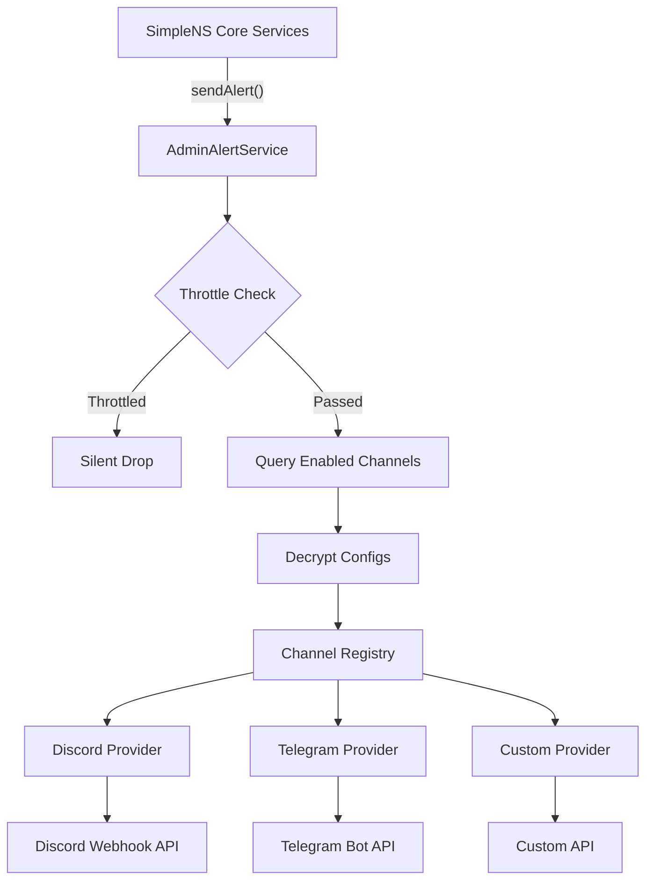

import { Tab, Tabs } from 'fumadocs-ui/components/tabs';
import { TypeTable } from 'fumadocs-ui/components/type-table';
import { Step, Steps } from 'fumadocs-ui/components/steps';
import { Callout } from 'fumadocs-ui/components/callout';

<div className="flex gap-2 mb-4">
  <LLMCopyButton markdownUrl="/docs/core/admin-alert-channels.mdx" />
  <ViewOptions 
    markdownUrl="/docs/core/admin-alert-channels.mdx"
    githubUrl="https://github.com/SimpleNotificationSystem/simplens-docs/blob/main/content/docs/core/admin-alert-channels.mdx"
  />
</div>

---

## Overview

Admin Alert Channels let you receive real-time alerts about your SimpleNS instance directly in platforms like **Discord** and **Telegram**. When something goes wrong — a notification fails, a service goes down, or processing gets stuck — SimpleNS can automatically notify your team through configured channels.

The system is built on an **extensible provider registry** pattern, making it easy to add new channel types beyond the built-in Discord and Telegram providers.

### Key Features

- **Encrypted credentials** — Channel configurations are stored with AES-256-GCM encryption
- **Alert filtering** — Choose which alert types each channel receives
- **Throttling** — Built-in 5-minute throttle window prevents alert storms
- **Fire-and-forget** — Alert delivery never blocks core notification processing
- **Extensible** — Add custom channel providers via the registry pattern

---

## Alert Types

SimpleNS monitors for five categories of issues:

| Alert Type | Emoji | Description |
|---|---|---|
| `failed_notification` | ❌ | A notification failed to deliver after all retries |
| `service_health` | 🔴 | Service-level issues (uncaught exceptions, unhandled rejections, server errors, Kafka disconnections) |
| `stuck_processing` | ⏳ | A notification has been in `processing` state longer than expected |
| `orphaned_pending` | 👻 | A notification is `pending` but has no corresponding outbox entry |
| `ghost_delivery` | 👻 | A delivery acknowledgment was received for an unknown notification |

---

## Severity Levels

Each alert carries a severity level that affects its visual presentation:

| Severity | Discord Color | Telegram Icon | Usage |
|---|---|---|---|
| `info` | 🔵 Blue | 🔵 | Informational, test messages |
| `warning` | 🟡 Yellow | 🟡 | Non-critical issues that need attention |
| `critical` | 🔴 Red | 🔴 | Service outages, uncaught exceptions |

---

## Built-in Channel Providers

<Tabs items={['Discord', 'Telegram']}>
<Tab value="Discord">

Sends alerts as rich embeds via Discord webhooks.

#### Credential Fields

<TypeTable
  type={{
    webhook_url: {
      description: 'Discord webhook URL (https://discord.com/api/webhooks/...).',
      type: 'url',
      required: true
    }
  }}
/>

#### Setup

<Steps>
<Step>
Open your Discord server → **Server Settings** → **Integrations** → **Webhooks**
</Step>
<Step>
Create a new webhook and copy the URL
</Step>
<Step>
Configure the channel in the SimpleNS dashboard or API
</Step>
</Steps>

#### Alert Format

Discord alerts appear as rich embeds with:
- Color-coded sidebar based on severity
- Alert type in the title with emoji prefix
- Message body as the embed description
- Optional fields for Notification ID, Channel, and Error details
- Timestamp and "SimpleNS Admin Alert" footer

</Tab>
<Tab value="Telegram">

Sends alerts as HTML-formatted messages via the Telegram Bot API.

#### Credential Fields

<TypeTable
  type={{
    bot_token: {
      description: 'Bot token from @BotFather (format: 123456789:ABCdef...).',
      type: 'secret',
      required: true
    },
    chat_id: {
      description: 'Target chat/group/channel ID (can be negative, e.g., -1001234567890).',
      type: 'string',
      required: true
    }
  }}
/>

#### Setup

<Steps>
<Step>
Create a bot via [@BotFather](https://t.me/BotFather) on Telegram
</Step>
<Step>
Add the bot to your target group or channel
</Step>
<Step>
Get the chat ID (use the `getUpdates` API or a bot like [@userinfobot](https://t.me/userinfobot))
</Step>
<Step>
Configure the channel in SimpleNS
</Step>
</Steps>

</Tab>
</Tabs>

---

## Channel Configuration Model

Each configured channel is stored in MongoDB with the following schema:

<TypeTable
  type={{
    channel_type: {
      description: 'Provider type: discord, telegram, email, or slack.',
      type: 'string',
      required: true
    },
    name: {
      description: 'Display name for this channel configuration (max 100 chars).',
      type: 'string',
      required: true
    },
    enabled: {
      description: 'Whether this channel is active.',
      type: 'boolean',
      default: 'true'
    },
    config: {
      description: 'Encrypted credential storage (see Credential Encryption below).',
      type: 'object',
      required: true
    },
    'alert_filters.failed_notifications': {
      description: 'Receive failed notification alerts.',
      type: 'boolean',
      default: 'true'
    },
    'alert_filters.service_health': {
      description: 'Receive service health alerts.',
      type: 'boolean',
      default: 'true'
    },
    'alert_filters.stuck_processing': {
      description: 'Receive stuck processing alerts.',
      type: 'boolean',
      default: 'true'
    },
    'alert_filters.orphaned_pending': {
      description: 'Receive orphaned pending alerts.',
      type: 'boolean',
      default: 'true'
    },
    'alert_filters.ghost_delivery': {
      description: 'Receive ghost delivery alerts.',
      type: 'boolean',
      default: 'false'
    }
  }}
/>

### Credential Encryption

Channel credentials are encrypted at rest using **AES-256-GCM**. The encrypted config object contains:

| Field | Description |
|---|---|
| `encrypted_data` | The encrypted credential JSON string |
| `iv` | Initialization vector for decryption |
| `auth_tag` | Authentication tag for integrity verification |

The encryption key is resolved in priority order:

<Steps>
<Step>
**Environment variable** — `ADMIN_ALERT_ENCRYPTION_KEY` (hex-encoded)
</Step>
<Step>
**MongoDB** — Auto-generated key stored in the `system_configs` collection
</Step>
<Step>
**Auto-generate** — If neither exists, a new key is created and persisted to MongoDB
</Step>
</Steps>

---

## API Reference

Admin channel endpoints are mounted at `/api/admin-channels` (no authentication required by default).

### List Available Providers

`GET /api/admin-channels/providers`

Returns metadata for all registered channel providers, including their credential schemas for dynamic form generation.

#### Response (200)

```json
{
  "providers": [
    {
      "channelType": "discord",
      "displayName": "Discord",
      "credentialFields": [
        {
          "name": "webhook_url",
          "type": "url",
          "label": "Discord Webhook URL",
          "placeholder": "https://discord.com/api/webhooks/...",
          "description": "Create a webhook in Server Settings → Integrations → Webhooks",
          "required": true,
          "pattern": "^https://discord\\.com/api/webhooks/.+"
        }
      ]
    },
    {
      "channelType": "telegram",
      "displayName": "Telegram",
      "credentialFields": [
        {
          "name": "bot_token",
          "type": "secret",
          "label": "Bot Token",
          "placeholder": "123456789:ABCdefGhI...",
          "description": "From @BotFather",
          "required": true,
          "pattern": "^[0-9]+:[a-zA-Z0-9_-]+$"
        },
        {
          "name": "chat_id",
          "type": "string",
          "label": "Chat ID",
          "placeholder": "-1001234567890",
          "description": "Channel or Group ID",
          "required": true,
          "pattern": "^-?[0-9]+$"
        }
      ]
    }
  ]
}
```

---

### Test Channel Connection

`POST /api/admin-channels/test`

Sends a test message through the specified channel to verify the configuration works.

#### Request Body

```json title="Request"
{
  "channel_type": "discord",
  "config": {
    "webhook_url": "https://discord.com/api/webhooks/123/abc"
  }
}
```

#### Responses

| Status | Description |
|---|---|
| `200` | `{ "success": true, "message": "Test message sent successfully!" }` |
| `200` | `{ "success": false, "error": "..." }` — Test failed (invalid credentials, API error) |
| `400` | Missing fields or unsupported channel type |

---

### Validate Channel Config

`POST /api/admin-channels/validate`

Validates a channel configuration against the provider's credential schema without sending a test message.

#### Request Body

```json title="Request"
{
  "channel_type": "telegram",
  "config": {
    "bot_token": "123456789:ABCdefGhI",
    "chat_id": "-1001234567890"
  }
}
```

#### Responses

| Status | Description |
|---|---|
| `200` | `{ "valid": true }` — Configuration is valid |
| `200` | `{ "valid": false, "errors": ["Bot Token is required"] }` — Validation errors found |
| `400` | Missing fields or unsupported channel type |

---

## Throttling

To prevent alert storms during cascading failures, the `AdminAlertService` throttles alerts by type. Each alert type has an independent **5-minute cooldown window** — if an alert of the same type was sent within the last 5 minutes, subsequent alerts are silently dropped.

```
Alert Timeline:
  00:00  failed_notification → ✅ Sent
  00:02  failed_notification → ❌ Throttled (within 5min window)
  00:02  service_health      → ✅ Sent (different type)
  05:01  failed_notification → ✅ Sent (window expired)
```

---

## Adding a Custom Channel Provider

To add a new channel provider (e.g., Slack, PagerDuty), implement the `AdminChannelProvider` interface and self-register with the channel registry:

```typescript title="src/admin-alerts/channels/slack.channel.ts"
import type {
  AdminChannelProvider,
  ChannelResult,
  AlertMetadata,
  CredentialField,
} from '../admin-channel.interface.js';
import { registerChannelProvider } from '../channel-registry.js';

export class SlackChannel implements AdminChannelProvider {
  readonly channelType = 'slack' as const;
  readonly displayName = 'Slack';

  constructor(private webhookUrl: string) {}

  getCredentialSchema(): CredentialField[] {
    return [{
      name: 'webhook_url',
      type: 'url',
      label: 'Slack Webhook URL',
      placeholder: 'https://hooks.slack.com/services/...',
      required: true,
    }];
  }

  async send(message: string, metadata?: AlertMetadata): Promise<ChannelResult> {
    // Implement Slack webhook delivery
  }

  async testConnection(): Promise<ChannelResult> {
    return this.send('✅ Test message from SimpleNS Admin Alerts', {
      alertType: 'service_health',
      severity: 'info',
    });
  }
}

// Self-register on module load
registerChannelProvider('slack', (config: unknown) => {
  const { webhook_url } = (config || {}) as { webhook_url?: string };
  return new SlackChannel(webhook_url || '');
});
```

Then import the channel file in `src/api/server.ts` for it to self-register:

```typescript
import "@src/admin-alerts/channels/slack.channel.js";
```

<Callout type="info">
Don't forget to add your new channel type to the `ADMIN_CHANNEL_TYPE` array in `src/types/schemas.ts` so it can be stored in the database.
</Callout>

---

## Architecture


